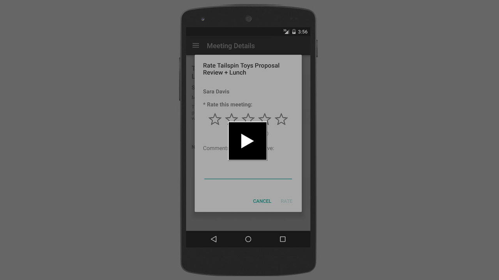
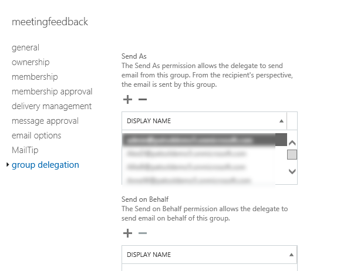
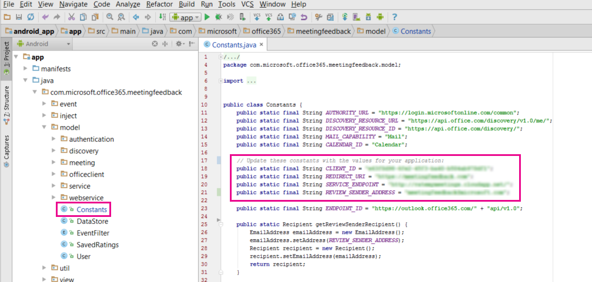

# Office 365 Meeting Feedback – Beispiel in Android

[](http://youtu.be/VXdEtKIPxi8 "Klicken Sie, um das Beispiel in Aktion zu sehen.")

Meeting Feedback verwendet die Office 365-Endpunkte in Microsoft Graph, um Kalenderereignisse abzurufen und E-Mails im Namen des angemeldeten Benutzers zu senden.

## Geräteanforderungen

Zum Ausführen des Beispiels muss das Gerät die folgenden Anforderungen erfüllen:

* Android-API-Ebene 15 oder höher.
 
## Voraussetzungen

Das Beispiel umfasst einen Android-Client und eine serverseitige Ruby on Rails-Komponente. Richten Sie auch einen Alias ein, von dem die Benutzer E-Mail-Benachrichtigungen erhalten können.

### Android-Clientkomponente

* [Android Studio](http://developer.android.com/sdk/index.html) Version 1.0 oder höher.
* Ein Office 365-Konto. Sie können sich für ein [Office 365-Entwicklerabonnement](http://aka.ms/o365-android-connect-signup) registrieren. Dieses umfasst die Ressourcen, die Sie zum Erstellen von Office 365-Apps benötigen. Wenn Sie sich für ein Entwicklerabonnement registrieren, erhalten Sie auch ein Office 365-Konto. 
* Eine Client-ID und Umleitungs-URI-Werte einer in Azure registrierten Anwendung. Die Anwendung muss über die Berechtigungen **E-Mails als Benutzer senden** und **Lesen von Benutzerkalendern** verfügen. Sie können auch [eine native Clientanwendung in Azure hinzufügen](https://msdn.microsoft.com/office/office365/HowTo/add-common-consent-manually#bk_RegisterNativeApp) und ihr die [entsprechenden Berechtigungen gewähren](https://github.com/OfficeDev/O365-Android-MeetingFeedback/wiki/Grant-permissions-to-the-application-in-Azure).

### Anwendungskomponente Ruby on Rails

* Ruby 2.0.0
* Ruby Development Kit (nur für Windows-Installationen)

## Installieren der Anwendung Ruby on Rails

1. Wechseln Sie zum Webdienstordner im Repository „O365-Android\_MeetingFeedback“.
2. Führen Sie die folgenden Befehle aus, um die nachstehenden Aufgaben auszuführen:

	* Installieren des Gems „builder“
	* Installieren der Ruby on Rails-Anwendung „Meeting Feedback“
	* Erstellen der Meeting Feedback-Datenbank
	* Starten des Meeting Feedback-Diensts auf Port 5000

```
gem install builder
bundle install
rake db:create && rake db:migrate && bundle exec foreman start -p 5000
```

## Einrichten einer E-Mail-Gruppe, um anonyme E-Mail-Benachrichtigungen zu erhalten

Durch die App wird eine E-Mail-Benachrichtigung an den Besprechungsorganisator gesendet, wenn eine von ihm gehostete Besprechung ein Feedback erhält. Die E-Mail stammt von einer festgelegten E-Mail-Adresse, um die Anonymität des Feedbacks zu bewahren. Damit dies möglich ist, müssen Sie eine Exchange-Gruppe in Office 365 einrichten. Gehen Sie dazu folgendermaßen vor:

1. Wechseln Sie zu http://office.com und melden Sie sich als Mandantenadministrator an.
2. Klicken Sie auf die Kachel **Admin**
3. Klicken Sie in der Navigationsleiste auf **Admin** -> **Exchange**.
4. Klicken Sie im Abschnitt **Empfänger** auf **Gruppen**.
5. Klicken Sie auf das Pluszeichen, um eine neue **Sicherheitsgruppe** hinzuzufügen.
6. Fügen Sie einen Anzeigenamen, einen Alias und eine E-Mail-Adresse hinzu und speichern Sie die Gruppe.
7. Wählen Sie die Gruppe aus, und klicken Sie auf das Stiftsymbol, um sie zu bearbeiten.
8. Wechseln Sie zu **Gruppendelegierung**, und verleihen Sie den Benutzern der App die Berechtigung **Senden als**, wie in der folgenden Abbildung gezeigt. 
9. Aktualisieren Sie den Wert von **REVIEW\_SENDER\_ADDRESS** in der Datei **Constants.java**, sodass er mit der E-Mail-Adresse Ihrer Gruppe übereinstimmt.
 

## Öffnen des Beispiels mithilfe von Android Studio

1. Installieren Sie [Android Studio](http://developer.android.com/tools/studio/index.html#install-updates), und fügen Sie gemäß den [Anleitungen](http://developer.android.com/sdk/installing/adding-packages.html) auf „developer.android.com“ die Android SDK-Pakete hinzu.
2. Laden Sie dieses Beispiel herunter, oder klonen Sie es.
3. Starten Sie Android Studio.
	1. Wählen Sie **Öffnen eines vorhandenen Android Studio-Projekts**.
	2. Navigieren Sie zu Ihrem lokalen Repository, und wählen Sie das Projekt „O365-Android-MeetingFeedback“ aus. Klicken Sie auf **OK**.
4. Öffnen Sie die Datei „Constants.java“.
	1. Suchen Sie nach der Konstante „SERVICE\_ENDPOINT“, und legen Sie den Wert auf die IP-Adresse des Computers und den Port fest, in dem Sie den Ruby on Rails-Dienst ausführen.
	2. Suchen Sie nach der Konstante „CLIENT\_ID“, und legen Sie ihren Wert „String“ entsprechend der Client-ID fest, die Sie in Azure Active Directory registriert haben.
	3. Suchen Sie nach der Konstante „REDIRECT\_URI“, und legen Sie ihren Wert „String“ entsprechend dem Umleitungs-URI fest, den Sie in Azure Active Directory registriert haben. 

    > Hinweis: Wenn Sie weder über „CLIENT\_ID“- noch über „REDIRECT\_URI“-Werte verfügen, [müssen Sie eine native Clientanwendung in Azure hinzufügen](https://msdn.microsoft.com/office/office365/HowTo/add-common-consent-manually#bk_RegisterNativeApp) und sich die Werte „CLIENT\_ID“ und „REDIRECT\_URI“ notieren.

Nach dem Einrichten des Beispiels können Sie es auf einem Emulator oder Gerät ausführen.

## Fragen und Kommentare

Wir freuen uns auf Ihr Feedback zu diesem Beispiel für „Office 365 Meeting Feedback“ Sie können uns Ihre Fragen und Vorschläge über den Abschnitt [Probleme](https://github.com/OfficeDev/O365-Android-Connect/issues) dieses Repositorys senden.

Allgemeine Fragen zur Office 365-Entwicklung sollten in [Stack Overflow](http://stackoverflow.com/questions/tagged/Office365+API) gestellt werden. Stellen Sie sicher, dass Ihre Fragen oder Kommentare mit [Office365] und [API] markiert sind.

Möchten Sie erfahren, wie wir dieses Beispiel erstellt haben? Lesen Sie unseren [Artikel in Medium](https://medium.com/p/572432b96089) (in englischer Sprache).

## Weitere Ressourcen

* [Office 365 APIs – Plattformübersicht](https://msdn.microsoft.com/office/office365/howto/platform-development-overview)  
* [Office 365 SDK für Android](https://github.com/OfficeDev/Office-365-SDK-for-Android)  
* [Get started with Office 365 APIs in apps](https://msdn.microsoft.com/office/office365/howto/getting-started-Office-365-APIs) (Erste Schritte mit Office 365-APIs in Apps, in englischer Sprache)
* [Office 365 APIs – Startprojekte und Codebeispiele](https://msdn.microsoft.com/office/office365/howto/starter-projects-and-code-samples)  
* [Office 365 Connect-Beispiel für Android](https://github.com/OfficeDev/O365-Android-Connect)  
* [Office 365 – Codeausschnitte für Android](https://github.com/OfficeDev/O365-Android-Snippets)  
*[Office 365 APIs – Startprojekt für Android](https://github.com/OfficeDev/O365-Android-Start)  
* [Office 365 Profile-Beispiel für Android](https://github.com/OfficeDev/O365-Android-Profile)  


## Copyright
Copyright (c) 2015 Microsoft. Alle Rechte vorbehalten.
